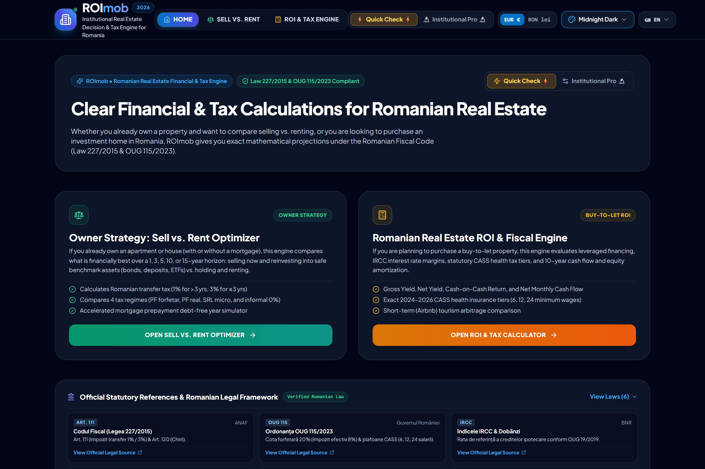
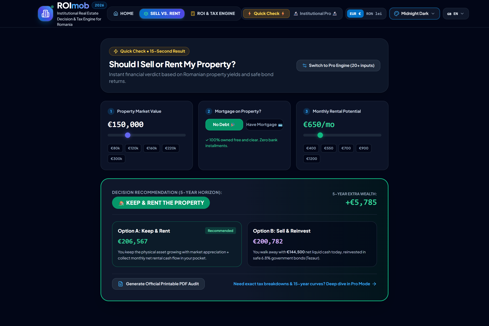
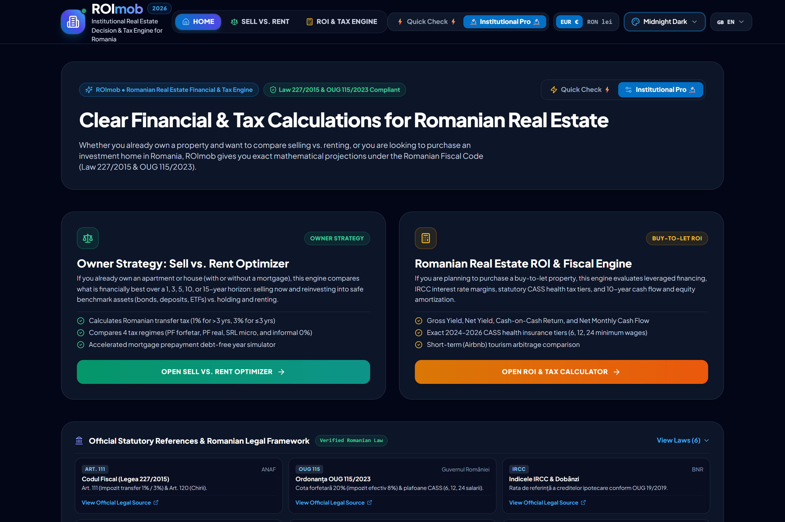
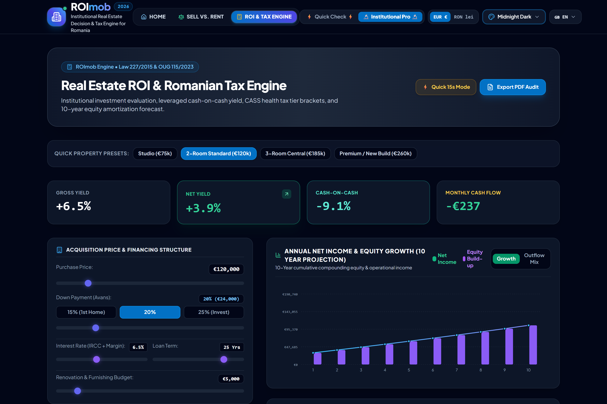
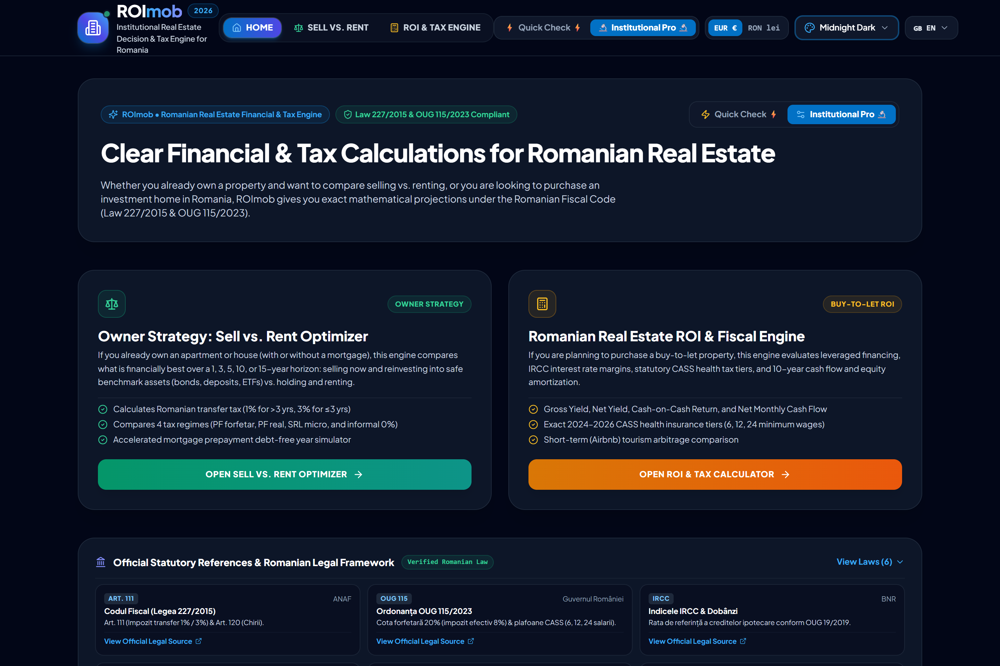
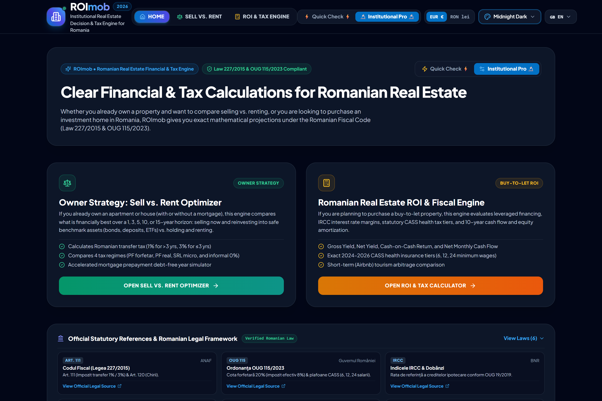

# 🏢 ROImob — Romanian Real Estate Financial & Tax Intelligence

<div align="center">

[](https://react.dev)
[](https://www.typescriptlang.org/)
[](https://tailwindcss.com)
[](https://static.anaf.ro)
[](https://opensource.org/licenses/MIT)
[](#-dual-mode-architecture-quick-⚡-vs-pro-🔬)
[-purple?style=for-the-badge)](#-multi-theme-system)
[-emerald?style=for-the-badge)](#-global-currency-toggle-eur--ron)
[](#-6-language-localization--translated-audit-reports)

**An open-source, customer-friendly and institutional-grade decision intelligence suite for Romanian real estate owners, buyers, and investors.**

[Overview](#-project-overview) • [Dual Modes](#-dual-mode-architecture-quick-⚡-vs-pro-🔬) • [Engine 1: Sell vs. Rent](#-engine-1-owner-strategy--sell-vs-rent-optimizer) • [Engine 2: ROI & Taxes](#-engine-2-romanian-real-estate-roi--fiscal-engine) • [Audit Reports](#-institutional-audit-reports--printable-dossiers) • [Currency & Charts](#-global-currency-toggle-eur--ron) • [Themes](#-multi-theme-system) • [Legal Basis](#-statutory-romanian-legal-basis) • [Localization](#-6-language-localization--translated-audit-reports)

<br />



</div>

---

## 📌 Project Overview

**ROImob** is an open-source, non-commercial financial modeling platform designed to bring institutional transparency, mathematical precision, and strict fiscal compliance to the Romanian residential real estate market.

Whether you are an everyday homeowner looking for a **15-second quick answer** or an institutional investor needing **deep legal underwriting with full statutory schedules**, ROImob models real-world transaction friction and taxation under **Romanian Law nr. 227/2015 (Codul Fiscal), Emergency Ordinance OUG nr. 115/2023, Emergency Ordinance OUG nr. 52/2016, and Law nr. 241/2005**.

```
                           ┌─────────────────────────────────────────────────────────┐
                           │            ROImob Decision Intelligence Hub             │
                           └────────────────────────────┬────────────────────────────┘
                                                        │
                         ┌──────────────────────────────┴──────────────────────────────┐
                         ▼                                                             ▼
              ┌─────────────────────────────────────┐                       ┌─────────────────────────────────────┐
              │              ENGINE 1               │                       │              ENGINE 2               │
              │         Owner Strategy:             │                       │      Romanian Real Estate ROI       │
              │     Sell vs. Rent Optimizer         │                       │           & Fiscal Engine           │
              │   (⚡ Quick 15s  |  🔬 Pro 15-Yr)   │                       │   (⚡ Quick 15s  |  🔬 Pro Underwr) │
              └─────────────────────────────────────┘                       └─────────────────────────────────────┘
```

---

## ⚡ Dual-Mode Architecture (Quick ⚡ vs. Pro 🔬)

To ensure the platform is intuitive for casual homeowners while providing comprehensive depth for professional investors, ROImob features an instant 1-tap **Dual-Mode System**:

### 1. ⚡ Quick Mode (15-Second Customer-Friendly Check)
- **3 Simple 1-Tap Sliders & Chips**: Evaluates property valuation, debt status, and expected monthly rent with zero jargon.
- **Instant Decision Verdict**: Plain-English recommendation (`🏡 KEEP & RENT THE PROPERTY` vs `💰 BETTER TO SELL NOW`) and a clear 5-year built wealth comparison.
- **Instant ROI Scorecard**: Fast net yield rating (`🔥 Top 10% in RO`, `⭐ Solid Strong Return`), take-home monthly cash in pocket, and capital payback period.

### 2. 🔬 Institutional Pro Mode (Deep Underwriting Engine)
- Over **20 customizable financial and statutory variables**: IRCC bank mortgage margins, accelerated debt prepayment payoff simulators, 4 distinct fiscal regimes, municipal building taxes, and 15-year multi-curve SVG trajectory models.

---

## ⚖️ ENGINE 1: Owner Strategy — Sell vs. Rent Optimizer

### ⚡ Quick Mode Preview
<div align="center">
  
</div>

### 🔬 Institutional Pro Mode Preview
<div align="center">
  
</div>

### Features & Capabilities:
1. **Market Valuation & Auto-Benchmarking**:
   - Integrated city estimator for Bucharest, Cluj-Napoca, Timișoara, Brașov, Iași, Constanța, Sibiu, Oradea, and Ilfov.
   - Neighborhood zone multipliers (*Ultra-Central +30%, Central +10%, Suburban -15%*) and condition adjustments.
2. **Strategy A: SELL NOW & Reinvest**:
   - Romanian Transfer Tax (Cod Fiscal Art. 111): **1%** for ownership > 3 years, **3%** for ≤ 3 years.
   - Reinvestment benchmarks: Safe State Treasury Bonds (*Titluri Tezaur / Fidelis 6.8%*), Bank Term Deposits (*3.5%*), and Global Index ETFs (*8.5%*).
3. **Strategy B: HOLD & RENT LONG-TERM**:
   - Full modeling of OUG 115/2023 20% deductible flat expense quota (effective 8% income tax) and statutory CASS health thresholds (6, 12, 24 minimum wages).
4. **Strategy C: SHORT-TERM AIRBNB ARBITRAGE**:
   - Seasonality, occupancy rates, and management expenses modeled for hospitality rentals.

---

## 📊 ENGINE 2: Romanian Real Estate ROI & Fiscal Engine

### ⚡ Quick Mode Preview
<div align="center">
  
</div>

### 🔬 Institutional Pro Mode Preview
<div align="center">
  
</div>

### Key Underwriting Metrics:
- **Top 4-Card KPI Ribbon**: Gross Yield, Net Yield ▲, Cash-on-Cash Return, and Net Monthly Take-Home Cash Flow.
- **10-Year Built Net Equity & Outflow Breakdown Chart**: Visualizes principal debt reduction, capital appreciation, and the exact distribution between bank debt, Romanian taxes, and operating reserves.
- **Romanian Statutory Rental Tax Schedule**:
  - `Impozit pe Venit din Chirii` (10% on 80% net rental base).
  - `CASS Sănătate` statutory brackets (2,220 lei, 4,440 lei, 8,880 lei annually).
  - `Impozit pe Clădiri` (0.1%–0.2% local residential quota) + mandatory PAD insurance.

---

## 📑 Institutional Audit Reports & Printable Dossiers

Generate authenticated, 2-page institutional private bank valuation dossiers in full compliance with Romanian Law nr. 227/2015:

<div align="center">
  
</div>

- **Page 1**: Official serialized letterhead (`ROIMOB-SVR-XXXXXX`), dark executive recommendation banner, dual-currency `EUR` + `RON` side-by-side valuation schedules, 5-yr & 10-yr multi-scenario projection matrices, and statutory tax itemization.
- **Page 2**: Executive strategic commentary, embedded vector SVG trajectory graphs, multi-year wealth schedules, and legal disclaimers.

---

## 💱 Global Currency Toggle (EUR ↔ RON)

- Instant 1-tap currency toggle in the navbar.
- Converted at the official BNR benchmark exchange rate ($1\text{ EUR} = 4.975\text{ RON}$).
- Updates every slider, input, KPI card, data table, and printable report dynamically.

---

## 🎨 Multi-Theme System

- 🌙 **Midnight Dark** (Default): Cyber-fintech navy slate with indigo/emerald accents.
- ☀️ **Corporate Light**: Crisp executive daylight theme.
- 🌲 **Emerald Wealth**: Deep forest and gold accents.
- 👁️ **High Contrast (AAA)**: High-visibility yellow rings and maximum contrast ratios compliant with WCAG AAA standards.

---

## 🌍 6-Language Localization & Translated Audit Reports

100% key parity across all 6 supported locales:
- 🇬🇧 **English (`en`)**
- 🇷🇴 **Română (`ro`)**
- 🇫🇷 **Français (`fr`)**
- 🇩🇪 **Deutsch (`de`)**
- 🇺🇦 **Українська (`uk`)**
- 🇵🇹 **Português (`pt`)**

---

## 🏛️ Statutory Romanian Legal Basis

| Statutory Authority | Legislation / Gazette | Modeled Provisions |
| :--- | :--- | :--- |
| **ANAF** | [Codul Fiscal (Legea 227/2015)](https://static.anaf.ro) | Art. 111 (1% vs 3% transfer tax), Art. 120 (Rental income) |
| **Guvernul României** | [OUG nr. 115/2023](https://legislatie.just.ro) | 20% deductible flat expense (8% effective rate) & CASS health brackets |
| **Banca Națională (BNR)** | [Indicele IRCC](https://www.bnr.ro) | Consumer mortgage benchmark rate modeling |
| **Ministerul Finanțelor** | [Titluri de Stat Tezaur & Fidelis](https://mfinante.gov.ro) | 100% Tax-free sovereign bonds reinvestment benchmark |
| **ANPC** | [OUG nr. 52/2016](https://legislatie.just.ro) | 0% prepayment penalty on variable interest mortgages |

---

## 🛠️ Quick Start for Developers

```bash
# Clone the repository
git clone https://github.com/ProfBandarra/ROImob.git
cd ROImob

# Install dependencies
npm install

# Start local dev server
npm run dev

# Run automated authentic Puppeteer screenshot capture
node scripts/capture_all_new_screenshots.js

# Build production bundle with TypeScript verification
npm run build
```

---

## 📄 License

Released under the open-source **[MIT License](LICENSE)**. Contributions, audits, and PRs from the community are warmly welcomed.
